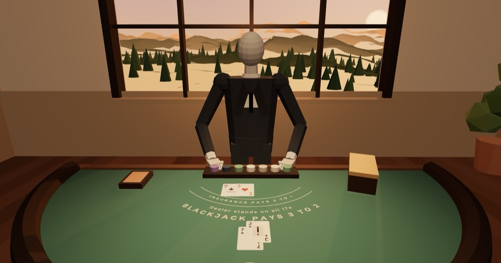

# Sundown Club

Small 3D browser games, set in one long evening that turns from golden hour to night.
Free to play, nothing to install, no account.

**Play: https://sundown-club.vercel.app**



## The games

| Game | What it is |
|---|---|
| [Blackjack](https://sundown-club.vercel.app/blackjack/) | Six decks, one seat, dealer stands on all 17s, blackjack pays 3 to 2. A quiet lounge and a dealer with no face. |
| [Texas Hold'em](https://sundown-club.vercel.app/holdem/) | No-limit, six seats, against five regulars who each play their own way. |
| [Video Poker](https://sundown-club.vercel.app/videopoker/) | Jacks or Better on a full-pay 9/6 machine by the window. |
| [Parking Precision](https://sundown-club.vercel.app/parking/play/) | First-person parking with a 720° steering wheel, mirrors and a reversing camera. 17 car parks, every park scored out of 100. |

The three card games share one play-money bankroll. Every game has a short
tutorial in plain English, and every game leaves the same way: press Esc once
to ask, Esc again to save and go back to the club.

Night Drive, a street racing game set after dark, is in development in
`apps/racing`.

## How it is built

- **3D:** three.js, with flat-shaded worlds, faceless mannequin figures, and cars built in code. Physics for the cars uses cannon-es.
- **Rules separate from graphics:** the card engines (`packages/shared/cards.js`, `apps/holdem/engine.js`, `apps/videopoker/engine.js`) are plain modules with no DOM. The page only plays back the events they return.
- **Tested logic:** `npm run check` checks poker hand ranking and plays 1,500 Hold'em hands to prove no chip is ever created or lost. It also measures video poker odds against the textbook figures.
- **One site from many apps:** npm workspaces. Parking Precision and Night Drive build with Vite; the hub and card games are static pages. `tools/build-site.mjs` assembles them into one `dist/`.
- **Privacy first:**
  - Progress is saved only in the player's browser.
  - There are no ads, no analytics and no tracking.
  - Fonts, three.js and GSAP are served from the site itself, never from another company's server.
  - The only data that leaves the browser is Parking Precision's opt-out leaderboard score, sent under a made-up name.
- **Accessible:** keyboard-first, visible focus, and respect for reduced-motion settings.

## Running it locally

Needs Node.js 20.19 or newer.

```
npm install
npm run build        # every app -> dist/
npm run serve        # the whole site on http://localhost:5180
npm run check        # pure-logic checks (takes a few minutes)
npm run dev:parking  # Parking Precision dev server, port 5175
npm run dev:racing   # Night Drive dev server, port 5177
```

The hub and card games import shared modules by site path, so open them through
`npm run serve`, not as loose files.

## Layout

| Path | What |
|---|---|
| `apps/hub` | The homepage: game picker, the evening scroll, your profile |
| `apps/blackjack`, `apps/holdem`, `apps/videopoker` | The card games |
| `apps/parking` | Parking Precision |
| `apps/racing` | Night Drive (in development) |
| `packages/shared` | Code every game shares: the 3D lounge, cards, chips, profile, the leave card |
| `tools` | Site assembly and the logic checks |
| `docs` | Deploying, search engines, design records |

## Licence

© 2026 Daksh Anajwala. All rights reserved.

The code is public so people can read it. It is not licensed for reuse,
copying or redistribution. Third-party code and fonts keep their own licences
(three.js and cannon-es: MIT; GSAP: its standard no-charge licence; the fonts:
SIL Open Font License); see the
[third-party notices](https://sundown-club.vercel.app/notices.html).

Bugs, ideas or questions: daksh.anajwala@gmail.com or
[github.com/DakshAnajwala](https://github.com/DakshAnajwala).
